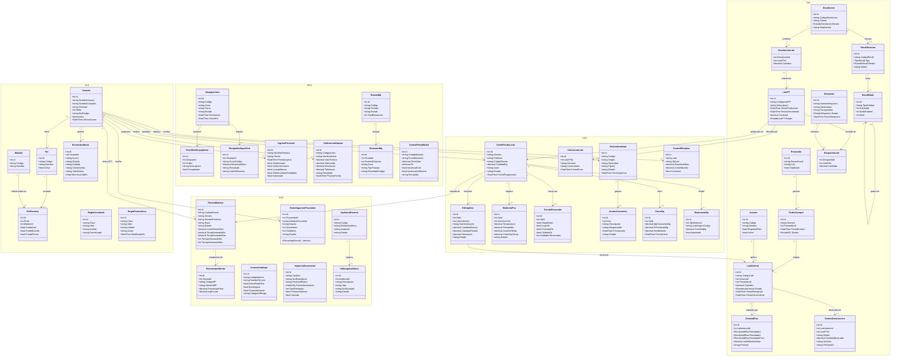

# Diagrama de Clases UML 2.0 — AxIA HACCP

> Generado: 2026-05-31  
> Cubre todos los módulos: SYS · PRQ · DOC · HAC · TRZ

```mermaid
classDiagram
    direction TB

    %% ══ SYS ══════════════════════════════════════════════════════
    namespace SYS {
        class Usuario {
            +int Id
            +string NombreUsuario
            +string NombreCompleto
            +string PinHash
            +int RolId
            +string RolCodigo
            +bool Activo
            +DateTime UltimoAcceso
        }
        class Rol {
            +int Id
            +string Codigo
            +string Nombre
            +bool Activo
        }
        class Modulo {
            +int Id
            +string Codigo
            +string Nombre
        }
        class RolPermiso {
            +int Id
            +int RolId
            +int ModuloId
            +bool PuedeLeer
            +bool PuedeEscribir
            +bool PuedeFirmar
        }
        class EventoAuditoria {
            +int Id
            +int UsuarioId
            +string Accion
            +string Modulo
            +string Entidad
            +string ValorAnterior
            +string ValorNuevo
            +DateTime OcurridoEn
        }
        class ReglaConstante {
            +int Id
            +string Clave
            +string Valor
            +string Unidad
            +string FuenteLegal
        }
        class ReglaParametrica {
            +int Id
            +string Clave
            +string Valor
            +string Unidad
            +string Grupo
            +DateTime ModificadoEn
        }
    }

    Rol "1" --> "0..*" RolPermiso : controla
    Modulo "1" --> "0..*" RolPermiso : referenciado en
    Usuario "0..*" --> "1" Rol : tiene
    Usuario "1" --> "0..*" EventoAuditoria : genera

    %% ══ PRQ ══════════════════════════════════════════════════════
    namespace PRQ {
        class DespejeLinea {
            +int Id
            +string Codigo
            +string Linea
            +string Turno
            +string Estado
            +DateTime FechaInicio
            +DateTime FechaFin
        }
        class ChecklistDespejeItem {
            +int Id
            +int DespejeId
            +int Orden
            +string Descripcion
            +bool Completado
        }
        class HisopadorSuperficie {
            +int Id
            +int DespejeId
            +string PuntoCodigo
            +decimal ResultadoPpm
            +string Resultado
            +string LoteKitReactivo
        }
        class IngresoPersonal {
            +int Id
            +string NombrePersona
            +string Sector
            +DateTime FechaIngreso
            +bool SinSintomas
            +bool UniformeCorrect
            +bool LavadoManos
            +bool SinElementosProhibidos
            +bool Autorizado
        }
        class CalibracionEquipo {
            +int Id
            +string CodigoActivo
            +string NombreActivo
            +decimal ValorTeorico
            +decimal ValorLeido
            +decimal Desviacion
            +decimal Tolerancia
            +string Resultado
            +DateTime ProximaFecha
        }
        class RondaMip {
            +int Id
            +string Codigo
            +string Periodo
            +string Estado
            +int TotalEstaciones
        }
        class EstacionMip {
            +int Id
            +int RondaId
            +int NumeroEstacion
            +string Zona
            +string TipoTrampa
            +string ResultadoCodigo
        }
        class ControlPotabilidad {
            +int Id
            +string CodigoMuestra
            +string PuntoMuestreo
            +decimal CloroLibre
            +decimal Ph
            +bool AusenciaEcoli
            +bool AusenciaColiformes
            +string Resultado
        }
    }

    DespejeLinea "1" --> "1..*" ChecklistDespejeItem : contiene
    DespejeLinea "1" --> "0..*" HisopadorSuperficie : registra
    RondaMip "1" --> "1..*" EstacionMip : incluye
    Usuario "1" --> "0..*" IngresoPersonal : supervisa
    Usuario "1" --> "0..*" CalibracionEquipo : realiza

    %% ══ DOC ══════════════════════════════════════════════════════
    namespace DOC {
        class RecetaMaestra {
            +int Id
            +string CodigoReceta
            +string Version
            +string NombreProducto
            +string Rnpa
            +string Estado
            +decimal LimiteGlutenPpm
            +decimal TempHorneadoMin
            +decimal TempHorneadoMax
            +int TiempoHorneadoMin
            +int TiempoHorneadoMax
        }
        class RecetaIngrediente {
            +int Id
            +int RecetaId
            +string CodigoMP
            +string NombreMP
            +decimal PorcentajePeso
            +decimal KgPorLote
        }
        class InsumoCatalogo {
            +int Id
            +string CodigoInterno
            +string NombreTecnico
            +bool ActivaFlujoElisa
            +bool EsAlergeno
            +bool ContactoDirecto
            +string CategoriaRiesgo
        }
        class HomologacionProveedor {
            +int Id
            +int ProveedorId
            +string NombreProveedor
            +string Insumo
            +int ScoreItems
            +int TotalItems
            +string Estado
            +PorcentajeScore() decimal
        }
        class VigenciaDocumento {
            +int Id
            +string TipoDoc
            +string NroExpediente
            +string ProductoPlanta
            +DateOnly FechaVencimiento
            +int DiasRestantes
            +bool ProximoAVencer
            +bool Vencido
        }
        class AuditoriaExterna {
            +int Id
            +string Codigo
            +string EntidadAuditora
            +string Inspector
            +string Estado
        }
        class HallazgoAuditoria {
            +int Id
            +int AuditoriaId
            +string Descripcion
            +string Tipo
            +string NcVinculada
            +string Estado
        }
    }

    RecetaMaestra "1" --> "1..*" RecetaIngrediente : compuesta de
    AuditoriaExterna "1" --> "0..*" HallazgoAuditoria : registra
    Usuario "1" --> "0..*" RecetaMaestra : firma (DT)
    Usuario "1" --> "0..*" HomologacionProveedor : evalúa

    %% ══ HAC ══════════════════════════════════════════════════════
    namespace HAC {
        class OrdenProduccion {
            +int Id
            +string Numero
            +string Producto
            +string CodigoReceta
            +decimal CantidadKg
            +string Linea
            +string Estado
            +DateTime FechaProgramada
        }
        class KittingItem {
            +int Id
            +int OpId
            +int LoteInternoId
            +string NombreInsumo
            +decimal CantidadTeorica
            +decimal CantidadPesada
            +decimal Desviacion
            +string Estado
        }
        class MedicionPcc {
            +int Id
            +int OpId
            +int NumeroCiclo
            +decimal Temperatura
            +decimal TiempoMin
            +decimal LimiteInfTemp
            +decimal LimiteSupTemp
            +string Estado
        }
        class EventoEnvasado {
            +int Id
            +int OpId
            +bool RnpaMatch
            +bool LogoOk
            +bool FechadoOk
            +bool SelladoOk
            +int UnidadesTerminadas
        }
        class LiberacionLote {
            +int Id
            +int LotePTId
            +string Decision
            +string Comentarios
            +DateTime FechaFirma
        }
        class NoConformidad {
            +int Id
            +string Codigo
            +string Origen
            +string Severidad
            +string TipoNc
            +string Estado
            +DateTime FechaApertura
        }
        class AccionCorrectiva {
            +int Id
            +int NcId
            +string Descripcion
            +string Responsable
            +DateTime FechaLimite
            +string Estado
        }
        class CierreOp {
            +int Id
            +int OpId
            +decimal MpConsumidaKg
            +decimal PtProducidoKg
            +decimal Rendimiento
            +DateTime FechaCierre
        }
        class ReprocesoOp {
            +int Id
            +int OpDestinoId
            +string LoteOrigenCodigo
            +decimal CantidadKg
            +bool Aprobado
        }
        class ControlElisaHac {
            +int Id
            +string Lote
            +string KitLote
            +decimal ResultadoPpm
            +decimal LimiteMaximo
            +bool Conforme
        }
    }

    OrdenProduccion "1" --> "0..*" KittingItem : requiere
    OrdenProduccion "1" --> "0..*" MedicionPcc : registra
    OrdenProduccion "1" --> "0..1" EventoEnvasado : cierra con
    OrdenProduccion "1" --> "0..1" CierreOp : tiene
    OrdenProduccion "1" --> "0..*" ReprocesoOp : recibe
    NoConformidad "1" --> "0..*" AccionCorrectiva : genera
    LotePT --> LiberacionLote : liberado por
    Usuario "1" --> "0..*" OrdenProduccion : planifica
    Usuario "1" --> "0..*" NoConformidad : registra
    Usuario "1" --> "0..*" ControlElisaHac : analiza

    %% ══ TRZ ══════════════════════════════════════════════════════
    namespace TRZ {
        class Proveedor {
            +int Id
            +string RazonSocial
            +string Cuit
            +bool Habilitado
        }
        class OrdenCompra {
            +int Id
            +string Numero
            +int ProveedorId
            +DateTime FechaEmision
            +EstadoOC Estado
        }
        class Insumo {
            +int Id
            +string Codigo
            +string Nombre
            +bool RequiereElisa
            +bool Activo
        }
        class LoteInterno {
            +int Id
            +string CodigoLote
            +int InsumoId
            +int ProveedorId
            +decimal Cantidad
            +EstadoLoteInterno Estado
            +DateTime FechaRecepcion
            +DateTime FechaVencimiento
        }
        class EventoElisa {
            +int Id
            +int LoteInternoId
            +ResultadoElisa Resultado1
            +ResultadoElisa Resultado2
            +ResultadoElisa ResultadoFinal
            +decimal LimiteMaximoPpm
            +string PinHash
        }
        class EventoDestruccion {
            +int Id
            +int LoteInternoId
            +int LotePTId
            +string Motivo
            +decimal CantidadDestruida
            +string NroActa
            +string PinHashDt
        }
        class LotePT {
            +int Id
            +string CodigoLotePT
            +string Descripcion
            +DateTime FechaProduccion
            +DateTime FechaVencimiento
            +decimal Cantidad
            +EstadoLotePT Estado
        }
        class Despacho {
            +int Id
            +string NumeroDespacho
            +string Destinatario
            +string Transportista
            +EstadoDespacho Estado
            +DateTime FechaDespacho
        }
        class DespachoLote {
            +int DespachoId
            +int LotePtId
            +decimal Cantidad
        }
        class RecallSession {
            +int Id
            +string CodigoRecall
            +TipoRecall Tipo
            +EstadoRecall Estado
            +string Motivo
        }
        class RecallNodo {
            +int Id
            +string TipoEntidad
            +int EntidadId
            +int NodoPadreId
            +int Nivel
        }
        class Devolucion {
            +int Id
            +string CodigoDevolucion
            +string Cliente
            +EstadoDevolucion Estado
            +string Disposicion
        }
        class DevolucionLote {
            +int DevolucionId
            +int LotePTId
            +decimal Cantidad
        }
    }

    Proveedor "1" --> "0..*" OrdenCompra : genera
    OrdenCompra "1" --> "0..*" LoteInterno : origina
    Insumo "1" --> "0..*" LoteInterno : tipifica
    LoteInterno "1" --> "0..1" EventoElisa : validado por
    LoteInterno "1" --> "0..1" EventoDestruccion : destruido en
    LotePT "1" --> "0..*" DespachoLote : incluido en
    Despacho "1" --> "1..*" DespachoLote : contiene
    RecallSession "1" --> "1..*" RecallNodo : traza
    RecallNodo "0..1" --> "0..*" RecallNodo : padre de
    Devolucion "1" --> "1..*" DevolucionLote : contiene
    DevolucionLote "0..*" --> "1" LotePT : referencia
    Devolucion "0..*" --> "0..1" RecallSession : vincula

    %% ══ Relaciones entre módulos ══════════════════════════════════
    OrdenProduccion --> RecetaMaestra : basada en
    KittingItem --> LoteInterno : consume
    LotePT --> OrdenProduccion : producido en
```
