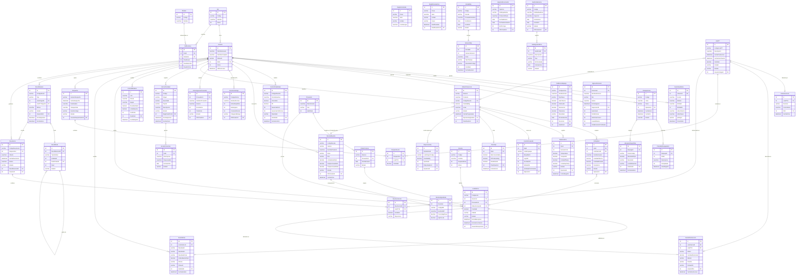

# Diagrama Entidad-Relación — AxIA HACCP

> Generado: 2026-05-31  
> Cubre todas las tablas: SYS · PRQ · DOC · HAC · TRZ

```mermaid
erDiagram

    %% ── SYS ────────────────────────────────────────────────────────
    Usuario {
        int Id PK
        nvarchar NombreUsuario
        nvarchar NombreCompleto
        varchar PinHash
        int RolId FK
        bit Activo
        datetime2 UltimoAcceso
    }
    Rol {
        int Id PK
        varchar Codigo
        nvarchar Nombre
        bit Activo
    }
    Modulo {
        int Id PK
        varchar Codigo
        nvarchar Nombre
    }
    RolPermiso {
        int Id PK
        int RolId FK
        int ModuloId FK
        bit PuedeLeer
        bit PuedeEscribir
        bit PuedeFirmar
    }
    EventoAuditoria {
        int Id PK
        int UsuarioId FK
        nvarchar Accion
        nvarchar Modulo
        nvarchar Entidad
        int EntidadId
        nvarchar ValorAnterior
        nvarchar ValorNuevo
        varchar IpOrigen
        datetime2 OcurridoEn
    }
    ReglaConstante {
        int Id PK
        varchar Clave
        nvarchar Valor
        varchar Unidad
        nvarchar FuenteLegal
    }
    ReglaParametrica {
        int Id PK
        varchar Clave
        nvarchar Valor
        varchar Unidad
        varchar Grupo
        datetime2 ModificadoEn
        int ModificadoPorId FK
    }

    Rol ||--o{ Usuario : "tiene"
    Rol ||--o{ RolPermiso : "controla"
    Modulo ||--o{ RolPermiso : "referenciado en"
    Usuario ||--o{ EventoAuditoria : "genera"

    %% ── PRQ ────────────────────────────────────────────────────────
    DespejeLinea {
        int Id PK
        varchar Codigo
        nvarchar Linea
        varchar Turno
        int OperarioId FK
        datetime2 FechaInicio
        datetime2 FechaFin
        nvarchar Estado
    }
    ChecklistDespejeItem {
        int Id PK
        int DespejeId FK
        int Orden
        nvarchar Descripcion
        bit Completado
        datetime2 HoraRegistro
    }
    HisopadorSuperficie {
        int Id PK
        int DespejeId FK
        varchar PuntoCodigo
        decimal ResultadoPpm
        varchar Resultado
        varchar LoteKitReactivo
        int AnalistaId FK
        datetime2 FechaAnalisis
    }
    IngresoPersonal {
        int Id PK
        int PersonaId FK
        nvarchar NombrePersona
        varchar Dni
        nvarchar Sector
        datetime2 FechaIngreso
        int SupervisorId FK
        bit Autorizado
        bit SinSintomas
        bit UniformeCorrect
        bit LavadoManos
        bit SinElementosProhibidos
    }
    CalibracionEquipo {
        int Id PK
        varchar CodigoActivo
        nvarchar NombreActivo
        varchar TipoTarea
        decimal ValorTeorico
        decimal ValorLeido
        decimal Desviacion
        decimal Tolerancia
        varchar Resultado
        date ProximaFecha
        int TecnicoId FK
        int AnalistaId FK
    }
    RondaMip {
        int Id PK
        varchar Codigo
        varchar Periodo
        nvarchar ProveedorNombre
        date FechaInicio
        date FechaFin
        varchar Estado
    }
    EstacionMip {
        int Id PK
        int RondaId FK
        int NumeroEstacion
        nvarchar Zona
        varchar TipoTrampa
        varchar ResultadoCodigo
        int Cantidad
        datetime2 FechaRevision
    }
    ControlPotabilidad {
        int Id PK
        varchar CodigoMuestra
        nvarchar PuntoMuestreo
        decimal CloroLibre
        decimal Ph
        bit AusenciaEcoli
        bit AusenciaColiformes
        varchar Resultado
        int AnalistaId FK
        datetime2 FechaControl
    }

    DespejeLinea ||--|{ ChecklistDespejeItem : "contiene"
    DespejeLinea ||--o{ HisopadorSuperficie : "registra"
    RondaMip ||--|{ EstacionMip : "incluye"
    Usuario ||--o{ DespejeLinea : "realiza"
    Usuario ||--o{ IngresoPersonal : "supervisa"
    Usuario ||--o{ CalibracionEquipo : "ejecuta"
    Usuario ||--o{ ControlPotabilidad : "analiza"

    %% ── DOC ────────────────────────────────────────────────────────
    RecetaMaestra {
        int Id PK
        varchar CodigoReceta
        varchar Version
        nvarchar NombreProducto
        varchar Rnpa
        varchar Rne
        decimal LimiteGlutenPpm
        decimal TempHorneadoMin
        decimal TempHorneadoMax
        varchar Estado
        int DtFirmadorId FK
        datetime2 FechaFirma
    }
    RecetaIngrediente {
        int Id PK
        int RecetaId FK
        varchar CodigoMP
        nvarchar NombreMP
        decimal PorcentajePeso
        decimal KgPorLote
    }
    InsumoCatalogo {
        int Id PK
        varchar CodigoInterno
        nvarchar NombreTecnico
        bit ActivaFlujoElisa
        bit EsAlergeno
        bit ContactoDirecto
        varchar CategoriaRiesgo
        int DtFirmadorId FK
    }
    HomologacionProveedor {
        int Id PK
        int ProveedorId FK
        nvarchar NombreProveedor
        nvarchar Insumo
        int ScoreItems
        int TotalItems
        varchar Estado
        int DtFirmadorId FK
    }
    VigenciaDocumento {
        int Id PK
        varchar TipoDoc
        varchar NroExpediente
        nvarchar ProductoPlanta
        date FechaEmision
        date FechaVencimiento
        bit EnProrroga
        int DtFirmadorId FK
    }
    AuditoriaExterna {
        int Id PK
        varchar Codigo
        nvarchar EntidadAuditora
        nvarchar Inspector
        date FechaInicio
        date FechaFin
        varchar Estado
        int DtFirmadorId FK
    }
    HallazgoAuditoria {
        int Id PK
        int AuditoriaId FK
        nvarchar Descripcion
        varchar Tipo
        varchar NcVinculada
        date FechaLimite
        varchar Estado
    }

    RecetaMaestra ||--|{ RecetaIngrediente : "compuesta de"
    AuditoriaExterna ||--o{ HallazgoAuditoria : "registra"
    Usuario ||--o{ RecetaMaestra : "firma (DT)"
    Usuario ||--o{ InsumoCatalogo : "aprueba (DT)"
    Usuario ||--o{ HomologacionProveedor : "evalúa"

    %% ── HAC ────────────────────────────────────────────────────────
    OrdenProduccion {
        int Id PK
        varchar Numero
        nvarchar Producto
        varchar CodigoReceta FK
        decimal CantidadKg
        nvarchar Linea
        varchar Estado
        datetime2 FechaProgramada
        int OperarioAsignadoId FK
        int PlanificadorId FK
    }
    KittingItem {
        int Id PK
        int OpId FK
        int LoteInternoId FK
        nvarchar NombreInsumo
        decimal CantidadTeorica
        decimal CantidadPesada
        decimal Desviacion
        varchar Estado
        int OperarioId FK
    }
    MedicionPcc {
        int Id PK
        int OpId FK
        int NumeroCiclo
        decimal Temperatura
        decimal TiempoMin
        decimal LimiteInfTemp
        decimal LimiteSupTemp
        varchar Estado
        int OperarioId FK
        datetime2 FechaRegistro
    }
    EventoEnvasado {
        int Id PK
        int OpId FK
        varchar LoteEmpaque
        bit RnpaMatch
        bit LogoOk
        bit FechadoOk
        bit SelladoOk
        int UnidadesTerminadas
        int OperarioId FK
    }
    LiberacionLote {
        int Id PK
        int LotePTId FK
        varchar Decision
        nvarchar Comentarios
        int DtId FK
        datetime2 FechaFirma
    }
    NoConformidad {
        int Id PK
        varchar Codigo
        varchar Origen
        varchar Severidad
        varchar TipoNc
        nvarchar Descripcion
        varchar Estado
        int RegistradoPorId FK
        datetime2 FechaApertura
        datetime2 FechaCierre
    }
    AccionCorrectiva {
        int Id PK
        int NcId FK
        nvarchar Descripcion
        nvarchar Responsable
        date FechaLimite
        varchar Estado
    }
    CierreOp {
        int Id PK
        int OpId FK
        decimal MpConsumidaKg
        decimal PtProducidoKg
        decimal Rendimiento
        int PlanificadorId FK
        datetime2 FechaCierre
    }
    ReprocesoOp {
        int Id PK
        int OpDestinoId FK
        varchar LoteOrigenCodigo
        decimal CantidadKg
        bit Aprobado
        int DtAprobadorId FK
        int OperarioId FK
    }
    ControlElisaHac {
        int Id PK
        nvarchar Lote
        nvarchar KitLote
        nvarchar Equipo
        decimal ResultadoPpm
        decimal LimiteMaximo
        bit Conforme
        int AnalistaId FK
        datetime2 FechaRegistro
    }

    OrdenProduccion ||--o{ KittingItem : "requiere"
    OrdenProduccion ||--o{ MedicionPcc : "registra"
    OrdenProduccion ||--o| EventoEnvasado : "cierra con"
    OrdenProduccion ||--o| CierreOp : "tiene"
    OrdenProduccion ||--o{ ReprocesoOp : "recibe reproceso"
    NoConformidad ||--o{ AccionCorrectiva : "genera"
    LotePT ||--o| LiberacionLote : "liberado por"
    Usuario ||--o{ OrdenProduccion : "planifica"
    Usuario ||--o{ NoConformidad : "registra"
    Usuario ||--o{ ControlElisaHac : "analiza"

    %% ── TRZ ────────────────────────────────────────────────────────
    Proveedor {
        int Id PK
        nvarchar RazonSocial
        varchar Cuit
        bit Habilitado
    }
    OrdenCompra {
        int Id PK
        varchar Numero
        int ProveedorId FK
        date FechaEmision
        varchar Estado
    }
    Insumo {
        int Id PK
        varchar Codigo
        nvarchar Nombre
        bit RequiereElisa
        bit Activo
    }
    LoteInterno {
        int Id PK
        varchar CodigoLote
        int InsumoId FK
        int ProveedorId FK
        int OrdenCompraId FK
        decimal Cantidad
        varchar Unidad
        varchar Estado
        datetime2 FechaRecepcion
        datetime2 FechaVencimiento
        int UsuarioRecepcionId FK
    }
    EventoElisa {
        int Id PK
        int LoteInternoId FK
        varchar Resultado1
        varchar Resultado2
        varchar ResultadoFinal
        decimal LimiteMaximoPpm
        varchar KitLote
        varchar PinHash
        int AnalistaId FK
        datetime2 FechaAnalisis
    }
    EventoDestruccion {
        int Id PK
        int LoteInternoId FK
        int LotePTId FK
        varchar Motivo
        decimal CantidadDestruida
        varchar Metodo
        varchar NroActa
        varchar PinHashDt
        int UsuarioDtId FK
        datetime2 FechaDestruccion
    }
    LotePT {
        int Id PK
        varchar CodigoLotePT
        nvarchar Descripcion
        datetime2 FechaProduccion
        datetime2 FechaVencimiento
        decimal Cantidad
        varchar Unidad
        varchar Estado
        int UsuarioCargaId FK
    }
    Despacho {
        int Id PK
        varchar NumeroDespacho
        datetime2 FechaDespacho
        nvarchar Destinatario
        nvarchar Transportista
        varchar RemitoCodigo
        varchar Estado
        int UsuarioDespachadorId FK
    }
    DespachoLote {
        int Id PK
        int DespachoId FK
        int LotePTId FK
        decimal Cantidad
    }
    RecallSession {
        int Id PK
        varchar CodigoRecall
        varchar Tipo
        int LoteOrigenId FK
        int LotePTOrigenId FK
        nvarchar Motivo
        varchar Estado
        int UsuarioDtId FK
        datetime2 FechaApertura
        datetime2 FechaCierre
    }
    RecallNodo {
        int Id PK
        int RecallSessionId FK
        varchar TipoEntidad
        int EntidadId
        int NodoPadreId FK
        int Nivel
        varchar Estado
    }
    Devolucion {
        int Id PK
        varchar CodigoDevolucion
        int DespachoId FK
        nvarchar Cliente
        datetime2 FechaDevolucion
        nvarchar Motivo
        varchar Estado
        int RecallSessionId FK
        int UsuarioId FK
    }
    DevolucionLote {
        int Id PK
        int DevolucionId FK
        int LotePTId FK
        decimal Cantidad
        varchar Disposicion
    }

    Proveedor ||--o{ OrdenCompra : "genera"
    Proveedor ||--o{ LoteInterno : "provee"
    OrdenCompra ||--o{ LoteInterno : "origina"
    Insumo ||--o{ LoteInterno : "tipifica"
    LoteInterno ||--o| EventoElisa : "validado por"
    LoteInterno ||--o| EventoDestruccion : "destruido en"
    LotePT ||--o| EventoDestruccion : "destruido en"
    LotePT ||--o{ DespachoLote : "incluido en"
    Despacho ||--|{ DespachoLote : "contiene"
    RecallSession ||--|{ RecallNodo : "traza"
    RecallNodo ||--o{ RecallNodo : "padre de"
    Devolucion ||--|{ DevolucionLote : "contiene"
    LotePT ||--o{ DevolucionLote : "referenciado en"
    RecallSession ||--o{ Devolucion : "vincula"
    Usuario ||--o{ LoteInterno : "recibe"
    Usuario ||--o{ EventoElisa : "analiza"
    Usuario ||--o{ Despacho : "opera"
    Usuario ||--o{ RecallSession : "coordina"
    Usuario ||--o{ Devolucion : "gestiona"

    %% ── Relaciones entre módulos ────────────────────────────────────
    OrdenProduccion }o--o| RecetaMaestra : "basada en (CodigoReceta)"
    KittingItem }o--o| LoteInterno : "consume"
    LotePT }o--o| OrdenProduccion : "producido en"
```
